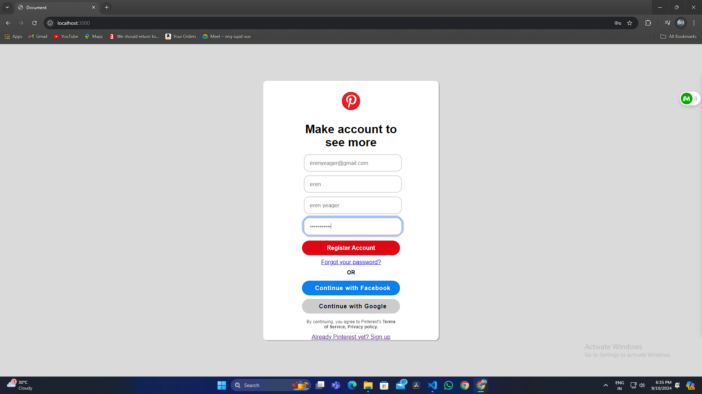
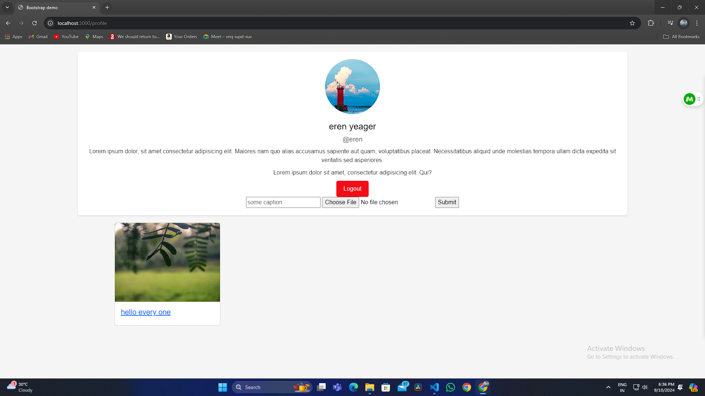
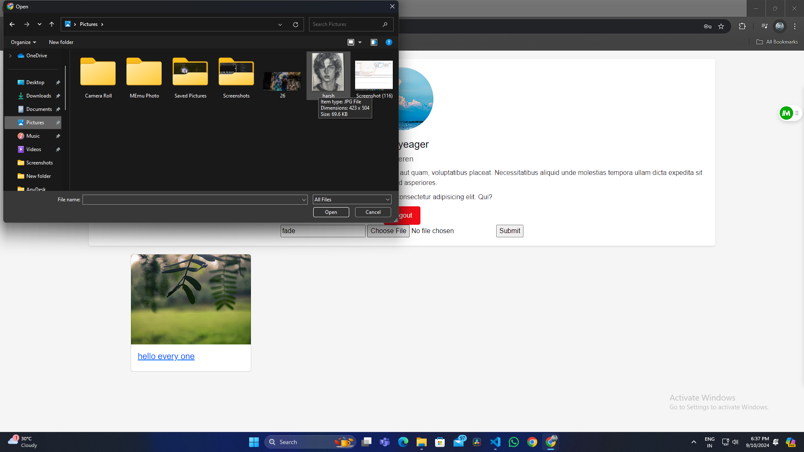
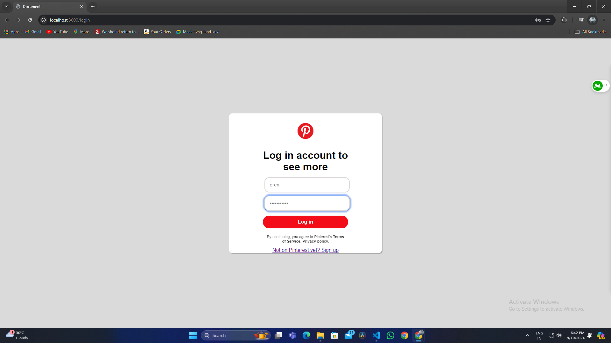
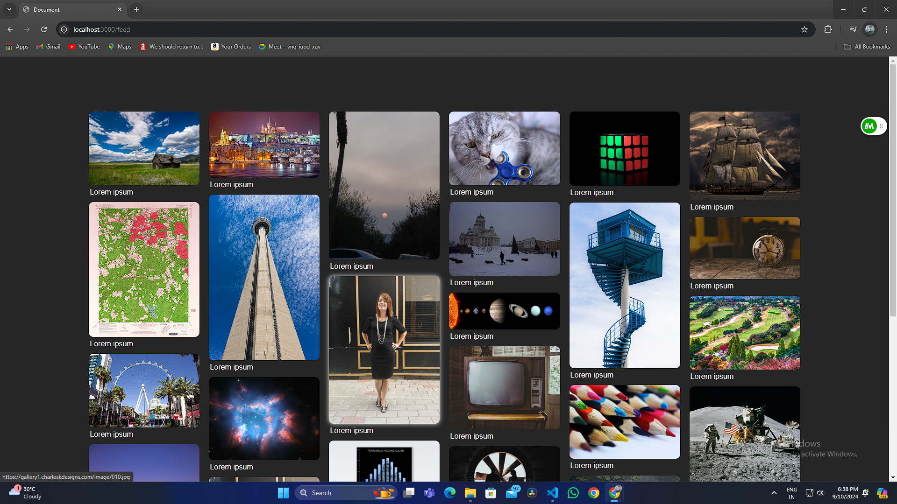

# Pinterest Clone

A clone of Pinterest built using Node.js, Express, MongoDB, and EJS. This project demonstrates backend development skills, including user authentication, file uploads, and dynamic rendering with server-side templating.

## Features

- User Registration and Login with Passport.js
- Profile Management with file upload support
- MongoDB as the database for storing user and post data
- Image uploads with captions using Multer
- Responsive design with Bootstrap 5
- Display user posts with dynamic rendering using EJS

## Technologies Used

- **Node.js**: JavaScript runtime environment
- **Express.js**: Web application framework for Node.js
- **MongoDB**: NoSQL database for data storage
- **Mongoose**: Object Data Modeling (ODM) library for MongoDB and Node.js
- **EJS**: Templating engine for dynamic HTML rendering
- **Bootstrap**: CSS framework for responsive design
- **Passport.js**: Middleware for user authentication
- **Multer**: Middleware for handling file uploads
- **UUID**: Used for generating unique filenames for uploaded images

## Installation

1. Clone the repository:

    ```bash
    git clone https://github.com/yourusername/pinterest-clone.git
    cd pinterest-clone
    ```

2. Install dependencies:

    ```bash
    npm install
    ```

3. Set up environment variables:

    Create a `.env` file in the root directory with the following environment variables:

    ```plaintext
    MONGODB_URI=your_mongodb_connection_string
    SESSION_SECRET=your_secret_key
    ```

4. Start the application:

    ```bash
    npm start
    ```

## Usage

- **Register/Login**: Create an account to start using the app.
- **Profile Page**: Upload your pictures and manage your posts.
- **Feed**: View all uploaded images.

## Screenshots

Here are some screenshots of the application:

### Homepage

*Homepage showing the main dashboard.*

### Profile Page

*Profile page with user details and posts.*

### Image Upload Form

*Form for uploading images with captions.*

### Login Page

*Login page with user details and posts.*

### Feed Page

*Feed page with user details and posts.*

### Database
.png)
*Feed page with user details and posts.*

### User
.png)
*user (server) with user details and posts.*

### Post
.png)
*Feed page with user details and posts.*


## Disclaimer

This project is built for educational purposes only. It is not affiliated with or endorsed by Pinterest.

## Contact

- **Author**: Harsh Payaal
- **LinkedIn**: [Your LinkedIn Profile]([https://www.linkedin.com/in/yourprofile/](https://www.linkedin.com/in/harsh-payaal-310148249/))


